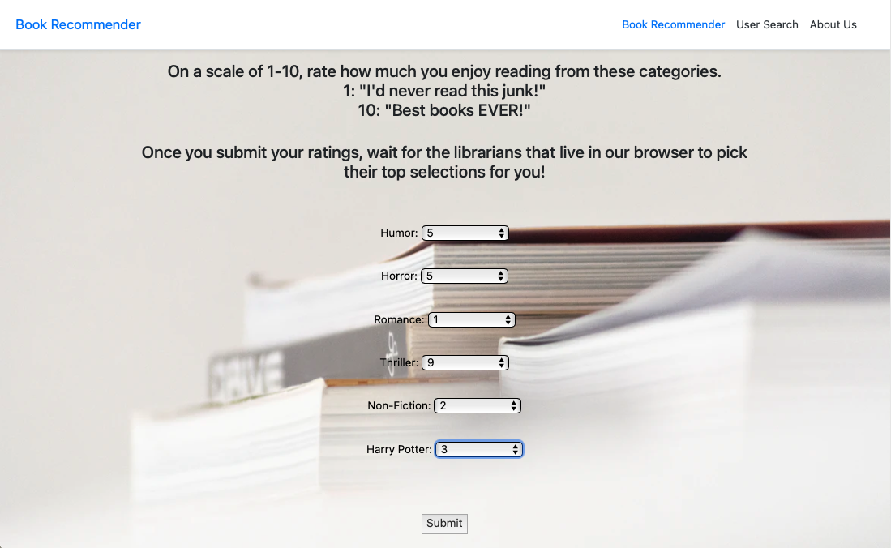
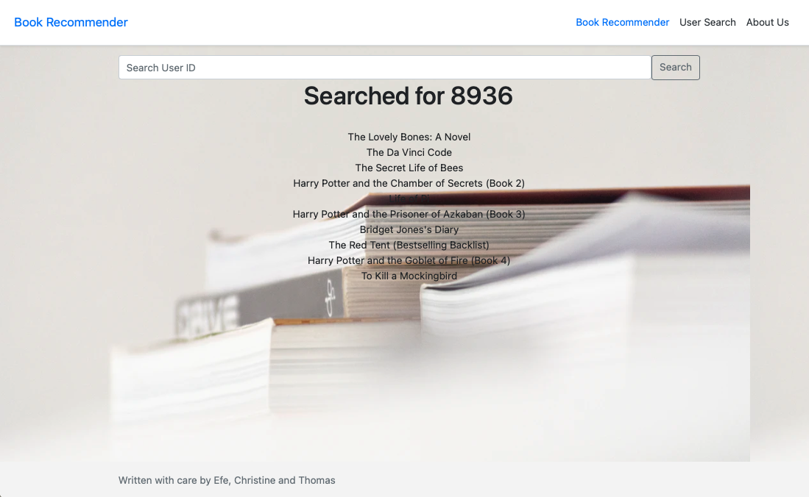
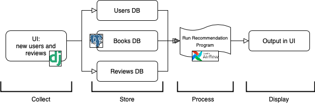
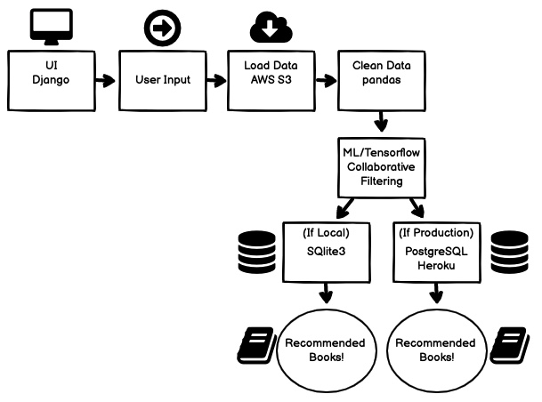

## Book Recommender
<b>A collaborative-based filtering recommendation system. </b>

## Creators
<b>Tom Lafferty:</b> https://github.com/TomLafferty</br>
<b>Efe Cantekin:</b> https://github.com/Efe-C-3</br>
<b>Christine Roethel:</b> https://github.com/croethel</br>

## Project Summary
Book recommendation system that is able to take 6 different user inputs based on user ratings of book categories and returns a machine learning based recommendation of 20 books identified by similiar existing users behaviors.</br>

Additionally, the book recommendation system can currently search pre-existing users (based on User ID) and render 10 book recommendations based on what similiar users have also reviewed.

## Screenshots
</img>
</img> 
</img>
</img> 


## Production
Currently deployed to Heroku, recommendations are currently not functional due to Heroku memory limitations.</br>
Existing code can be successfully ran locally (note: data set is currently connected to S3 bucket, would need to configure dotenv library and .env directory locally)</br>

Maintanance version deployed to:</br>
https://bookrecommender22.herokuapp.com/</br>

## Stack
Python</br>
Django</br>
Postgresql (when deployed)</br>
SQLite3 (when ran local)</br>
AWS S3</br>
TensorFlow</br>
Scikit-learn</br>
Heroku</br>
Pandas</br>


## Local Usage

Book recommender can be installed via Pip. To start, clone the repo to your local computer and change into the proper directory.

```
$ python3 -m venv bookrec
$ source bookrec/bin/activate
(bookrec) $ pip install -r requirements.txt
(bookrec) $ python manage.py migrate
(bookrec) $ python manage.py createsuperuser
(bookrec) $ python manage.py runserver
# Load the site at http://127.0.0.1:8000
```


## Data set source credit
https://www.kaggle.com/jirakst/bookcrossing</br>
(Adjusted column names 'User-ID', 'Book-Rating' and 'Book-Title' to 'UserID', 'BookRating' and 'BookTitle' in all .csv files)


## Flowchart
Initial:</br>
</img></br></br>

Current:</br>
</img>
